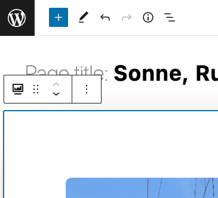
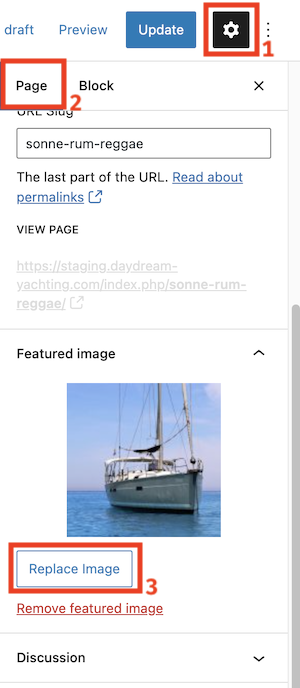
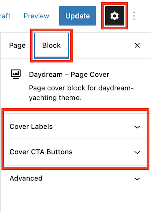
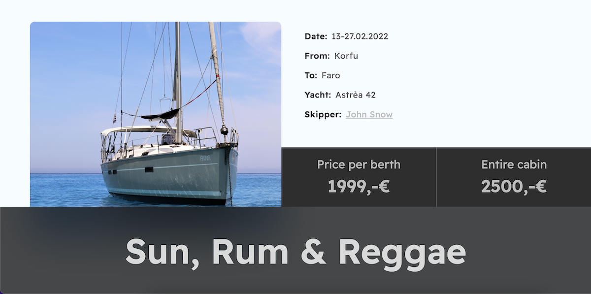
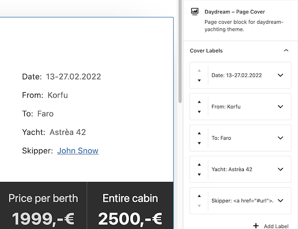
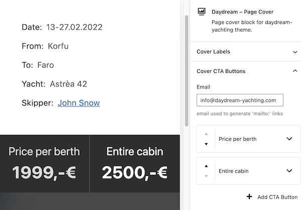

# Daydream Cover Gutenberg Block
**Author:**      STRM Jan Mirecki  
**Tags:**              block  
**Tested up to:**      5.9  
**Stable tag:**        1.0.0  

Page cover block for daydream-yachting theme.

## Description

This plugin contains the custom "gutenberg" block dedicated to the daydream-yachting theme.
It adds the Page Cover module that you can acces by choosing 'Daydream – Page Cover' block from the WordPress page/posts editor.

This plugin is created based on the files generated by [@wordpress/create-block](https://developer.wordpress.org/block-editor/reference-guides/packages/packages-create-block/) with the following command: `npx @wordpress/create-block daydream-cover`

## Installation

1. Clone the repository
2. Run `npm install`
3. Run `npm run plugin-zip` to generate the plugin **zip** archive
4. Upload the plugin files to the `/wp-content/plugins/daydream-cover` directory, or install the plugin through the WordPress plugins screen directly.
5. Activate the plugin through the 'Plugins' screen in WordPress

## Development

Daydream Cover plugin source files are upgraded with eslint and prettier config created by the WordPress team, so you can easily enable the static code analysis in your IDE.

To easily start the clean WordPress instance with the plugin for development purposes you can use the `wp-env` [CLI](https://developer.wordpress.org/block-editor/reference-guides/packages/packages-env/).

1. `cd` to the cloned plugin directory
2. Run `wp-env start`
3. The local environment will be available at http://localhost:8888 (Username: admin, Password: password).
4. Run `npm start` to start watching for plugin changes

## Usage

Cover contains 4 different parts editable in the WordPress editor:
  - **Featured Image**
  - **Cover Title**
  - **Cover Features Labels**
  - **Cover CTA Buttons**

To acces the editing features, select the Page Cover block by clicking on it in the editor. You should see a blue border around it and the basic controls tooltip, like on the image below.  

1. **Featured Image** – you can edit it by changing the page/post "Featured image"  
   
2. **Cover Title** – it's the page/post title. Change it by changing the title on the very top in the WordPress editor.
3. **Cover Features Labels** – Edit under the Page/Post settings: *Block Tab > Cover Labels*
   - You can add up to 8 labels
   - The label descriptions accepts HTML. You can add there any HTML tags for example `<b>bold tag</b>` or `<a href="…">some link</a>`. **Be extra careful with that** – it can potentially break your layout.
   - You can reorder the labels by the up and down arrows on the left of the item.
4. **Cover CTA Buttons** – Edit under the Page/Post settings: *Block Tab > Cover CTA Buttons*
   - The default email address for the `mailto` links is the Page/Post author email. You can change it to any other email. It's used by the **Generate mailto link** buttons.
   - You can setup up to 3 CTA buttons
   - You can add any custom link to your buttons, or generate the email template by using the **Generate mailto link** button.

## Screenshots

  
Desktop layout of the Page Cover

  
Editable cover labels

  
Editable CTA buttons

# Changelog

* 1.0.0
    * Release

